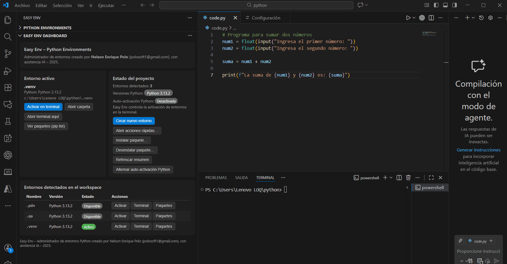
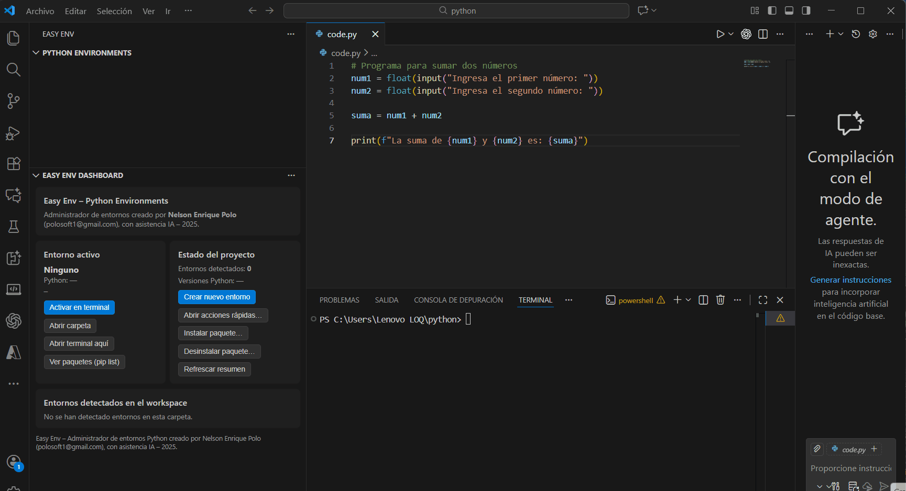
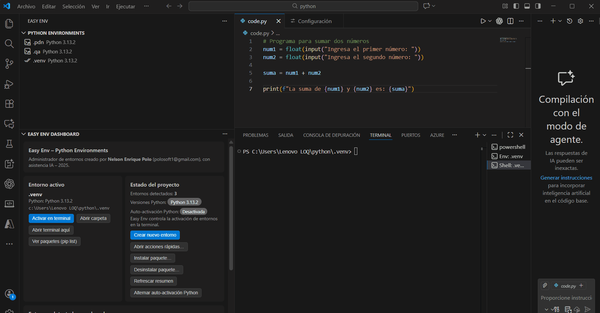

# Easy Env (Facil ENV)

Extension de VS Code para detectar, crear y administrar entornos Python desde una experiencia visual (Tree + Dashboard) y un wizard guiado.



## Tabla de contenido

- [Que hace Easy Env](#que-hace-easy-env)
- [Gestores soportados](#gestores-soportados)
- [Instalacion](#instalacion)
- [Requisitos](#requisitos)
- [Inicio rapido](#inicio-rapido)
- [Dashboard](#dashboard)
- [Flujo de creacion de entornos](#flujo-de-creacion-de-entornos)
- [Comandos disponibles](#comandos-disponibles)
- [Configuracion](#configuracion)
- [Como detecta el manager recomendado](#como-detecta-el-manager-recomendado)
- [Instalacion de dependencias del proyecto](#instalacion-de-dependencias-del-proyecto)
- [Troubleshooting](#troubleshooting)
- [Seguridad al eliminar entornos](#seguridad-al-eliminar-entornos)
- [Desarrollo local](#desarrollo-local)
- [Autor](#autor)
- [Licencia](#licencia)

## Que hace Easy Env

- Deteccion multi-manager: `venv`, `uv`, `conda`, `poetry`, `pipenv`.
- Creacion de entornos con wizard.
- Recomendacion automatica del manager segun archivos del proyecto.
- Diagnostico del entorno (python/gestores/extension Python/senales del proyecto).
- Instalacion y desinstalacion de paquetes (`pip`).
- Instalacion de dependencias de proyecto detectadas.
- Activacion de entornos en terminal.
- Cambio de interprete del workspace.
- Instalacion/configuracion de gestores faltantes desde la extension.
- Dashboard con filtros, busqueda, orden y acciones rapidas.

## Gestores soportados

| Manager | Detectar | Crear desde wizard | Instalar desde Easy Env |
|---|---|---|---|
| `venv` | Si | Si | No aplica |
| `uv` | Si | Si | Si |
| `conda` | Si | Si | Si |
| `poetry` | Si | Si | Si |
| `pipenv` | Si | Si | Si |

Notas:

- `poetry` requiere `pyproject.toml` para flujo de creacion.
- `pipenv` puede crear el entorno y `Pipfile` si no existe.
- `conda` usa `--prefix` para crear entornos locales en el workspace.

## Instalacion

### Opcion 1: VS Code Marketplace

1. Abre VS Code.
2. Ve a `Extensions`.
3. Busca `Facil ENV` o `Easy Env`.
4. Instala la extension del publisher `easyenv-dev`.

### Opcion 2: VSIX local

Si tienes el archivo `.vsix`:

```bash
code --install-extension facil-env-vscode-1.0.9.vsix
```

## Requisitos

- VS Code `^1.106.0`.
- Python disponible en sistema para usar `venv`/`pip`.
- Gestores opcionales para flujos avanzados:
  - `uv`
  - `conda`
  - `poetry`
  - `pipenv`

Recomendado:

- Extension oficial de Python (`ms-python.python`).

## Inicio rapido

1. Abre una carpeta de proyecto en VS Code.
2. Abre la vista `Easy Env` (barra lateral).
3. Ejecuta `Easy Env: Diagnostico del entorno`.
4. Si falta un gestor, usa `Easy Env: Instalar o configurar gestor (uv/conda/poetry/pipenv)`.
5. Ejecuta `Easy Env: Crear entorno Python (wizard)`.
6. Aplica acciones post-creacion (interprete, terminal, perfil de paquetes, deps de proyecto).

## Dashboard

El dashboard incluye:

- Tarjeta del entorno activo.
- Estado del proyecto (cantidad de entornos, versiones detectadas, auto-activacion Python).
- Botones de accion rapida.
- Tabla de entornos detectados con:
  - filtro por manager,
  - busqueda por nombre/version/ruta,
  - orden por nombre/manager/version/activo,
  - boton `Reset` de filtros.

Acciones disponibles desde la tabla:

- Activar entorno.
- Abrir terminal.
- Ver paquetes.

Acciones globales del dashboard:

- Crear entorno.
- Acciones rapidas.
- Instalar/Desinstalar paquete.
- Instalar deps de proyecto.
- Diagnostico.
- Refrescar.
- Alternar auto-activacion de la extension Python.




## Flujo de creacion de entornos

El wizard permite elegir manager y parametros:

- `venv`:
  - nombre del entorno (ej: `.venv`, `.dev`, `.qa`).
- `uv`:
  - nombre del entorno.
- `conda`:
  - nombre/carpeta del entorno (dentro del workspace),
  - version de Python opcional (ej: `3.11`).
- `poetry`:
  - crear en proyecto (`.venv`) o usar modo actual de Poetry.
- `pipenv`:
  - crear en proyecto (`.venv`) o modo global de Pipenv.

Despues de crear:

- usa preferencias guardadas, o
- ajusta solo esta vez, o
- actualiza preferencias por defecto.

Preferencias post-creacion:

- usar como interprete del workspace,
- abrir terminal activado,
- instalar dependencias del proyecto,
- instalar un perfil de paquetes:
  - `API (FastAPI)`: `fastapi`, `uvicorn`
  - `Data Science`: `numpy`, `pandas`, `matplotlib`, `jupyter`
  - `Testing`: `pytest`, `pytest-cov`
  - `Sin perfil`

## Comandos disponibles

### En la paleta de comandos

- `Refrescar entornos`
- `Crear entorno Python (wizard)`
- `Easy Env: Configurar acciones post-creacion`
- `Easy Env: Activar entorno`
- `Easy Env: Usar como interprete del workspace`
- `Easy Env: Eliminar entorno`
- `Easy Env: Abrir carpeta del entorno`
- `Easy Env: Abrir terminal en la ruta del entorno`
- `Easy Env: Ver paquetes del entorno (pip list)`
- `Easy Env: Instalar paquete en entorno`
- `Easy Env: Instalar dependencias del proyecto`
- `Easy Env: Desinstalar paquete del entorno`
- `Easy Env: Acciones rapidas sobre entorno...`
- `Easy Env: Diagnostico del entorno`
- `Easy Env: Instalar o configurar gestor (uv/conda/poetry/pipenv)`
- `Easy Env: Alternar auto-activacion de extension Python`
- `Acerca de la extension`

### Context menu de cada entorno (Tree View)

- Activar
- Usar como interprete
- Ver paquetes
- Instalar deps de proyecto
- Instalar paquete
- Desinstalar paquete
- Abrir carpeta
- Abrir terminal
- Eliminar

## Configuracion

Settings soportadas:

- `easyenv.condaPath`
- `easyenv.uvPath`
- `easyenv.poetryPath`
- `easyenv.pipenvPath`

Se usan cuando el gestor no esta en `PATH`.

Ejemplos Windows:

```text
C:\Users\<usuario>\miniconda3\Scripts\conda.exe
C:\Users\<usuario>\AppData\Roaming\Python\Python313\Scripts\uv.exe
C:\Users\<usuario>\AppData\Roaming\Python\Python313\Scripts\poetry.exe
C:\Users\<usuario>\AppData\Roaming\Python\Python313\Scripts\pipenv.exe
```

Tip:

- Si instalas un gestor durante la sesion actual, usa `Easy Env: Instalar o configurar gestor...` y/o configura ruta manual para evitar depender de reiniciar VS Code.

## Como detecta el manager recomendado

Orden de recomendacion:

1. Si existe `uv.lock` -> recomienda `uv`.
2. Si existe `Pipfile` -> recomienda `pipenv`.
3. Si `pyproject.toml` contiene `[tool.poetry]` -> recomienda `poetry`.
4. Si existe `environment.yml`, `environment.yaml`, `conda.yml` o `conda.yaml` -> recomienda `conda`.
5. Si no detecta senales -> recomienda `venv`.

## Instalacion de dependencias del proyecto

Al ejecutar `Easy Env: Instalar dependencias del proyecto`, Easy Env busca:

- `requirements.txt`
- `requirements-dev.txt`
- `requirements-dev.in`
- `requirements/base.txt`
- `pyproject.toml` (instala editable con `pip install -e .`)

Ejecuta cada fuente detectada dentro del entorno seleccionado.

## Troubleshooting

### 1) "No se encontro <manager> en PATH"

Opciones recomendadas:

1. Ejecuta `Easy Env: Instalar o configurar gestor (uv/conda/poetry/pipenv)`.
2. Si ya esta instalado, usa `Configurar ruta manual`.
3. Ejecuta `Easy Env: Diagnostico del entorno`.

### 2) Conda instalado pero no detectado

- Configura `easyenv.condaPath` o usa la opcion de seleccionar ejecutable.
- En Windows, una ruta comun es:
  - `C:\Users\<usuario>\miniconda3\Scripts\conda.exe`

### 3) Error `CondaToSNonInteractiveError`

Conda exige aceptar ToS de canales. Easy Env muestra la accion `Aceptar ToS en terminal` y envia comandos como:

```powershell
conda tos accept --override-channels --channel https://repo.anaconda.com/pkgs/main
conda tos accept --override-channels --channel https://repo.anaconda.com/pkgs/r
conda tos accept --override-channels --channel https://repo.anaconda.com/pkgs/msys2
```

Luego vuelve a crear el entorno.

### 4) "No se pudo inferir automaticamente el entorno creado"

Puede pasar con `conda`, `poetry` o `pipenv` por tiempos de deteccion o ubicaciones externas.

- Easy Env reintenta varias veces.
- Si aun falla, selecciona manualmente el entorno cuando lo pida.
- Refresca la vista (`Refrescar entornos`).

### 5) Error instalando `poetry`/`pipenv` con `py -m pip`

Si tu launcher `py` apunta a una ruta rota de Python, repara o reinstala Python.

Como alternativa:

- instala desde Easy Env,
- o usa `python -m pip ...` si `python` funciona,
- o configura `easyenv.poetryPath` / `easyenv.pipenvPath`.

## Seguridad al eliminar entornos

- Si el entorno esta fuera del workspace, se solicita confirmacion escribiendo el nombre exacto.
- Para `venv`/`uv`:
  - se prioriza mover a papelera (recomendado),
  - con fallback a eliminacion permanente si la papelera falla.
- Para `conda`:
  - se elimina con `conda env remove --prefix <ruta> -y`.
- Para `poetry`/`pipenv` fuera del workspace:
  - por seguridad, no se elimina automaticamente.

## Desarrollo local

### Requisitos

- Node.js y npm.
- VS Code.

### Comandos

```bash
npm install
npm run compile
npm run watch
npm run lint
```

### Probar extension en local

1. Abre el repo en VS Code.
2. Ejecuta `npm run compile`.
3. Presiona `F5` para abrir Extension Development Host.
4. Prueba comandos de Easy Env en un workspace Python.

## Autor

Nelson Enrique Polo  
Email: `polosoft1@gmail.com`  
GitHub: `https://github.com/polosoft1/Facil-ENV`

## Licencia

MIT (ver `LICENSE.txt`).
